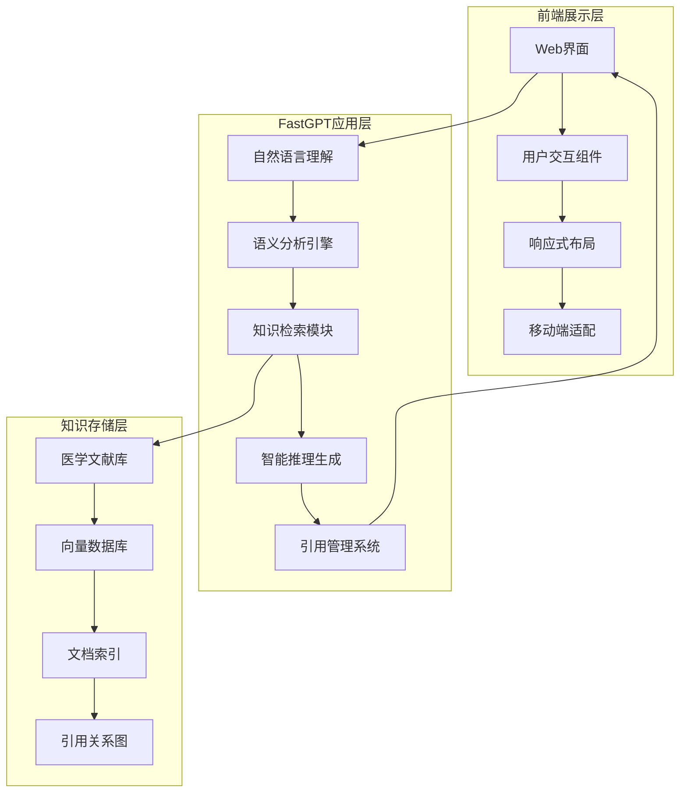
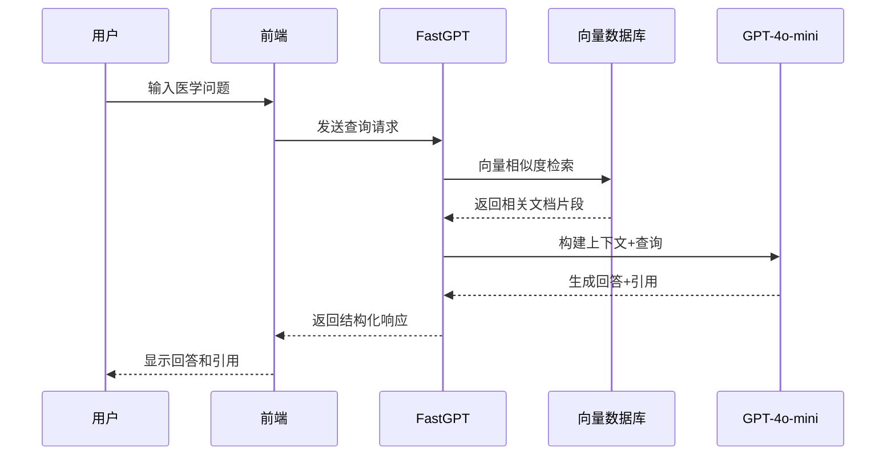

# 技术架构文档

## 🏗️ 系统架构概览

医学智能检索与决策支持助手采用三层架构设计，实现前端展示、智能处理和知识存储的分离。



## 🔧 技术栈详解

### 前端技术

#### 核心技术
- **HTML5**: 语义化标记，支持现代Web标准
- **CSS3**: 响应式设计，CSS Grid和Flexbox布局
- **JavaScript ES6+**: 现代JavaScript特性，模块化开发

#### 框架和库
```javascript
// 主要依赖
{
  "framework": "Vanilla JavaScript",
  "ui": "原生CSS + Bootstrap组件",
  "icons": "Font Awesome",
  "charts": "Chart.js (可选)",
  "mobile": "响应式设计"
}
```

#### 响应式设计
```css
/* 断点定义 */
@media (max-width: 768px) { /* 移动端 */ }
@media (min-width: 769px) and (max-width: 1024px) { /* 平板 */ }
@media (min-width: 1025px) { /* 桌面端 */ }
```

### 后端服务

#### FastGPT集成
- **平台**: FastGPT智能问答平台
- **API**: RESTful API接口
- **认证**: Token-based身份验证
- **限流**: QPM（每分钟查询数）控制

#### AI模型配置
```json
{
  "llm_model": {
    "name": "GPT-4o-mini",
    "provider": "OpenAI",
    "max_tokens": 4000,
    "temperature": 0.1,
    "top_p": 0.9
  },
  "embedding_model": {
    "name": "text-embedding-3-large",
    "provider": "OpenAI",
    "dimensions": 3072,
    "similarity_metric": "cosine"
  }
}
```

### 数据存储

#### 知识库架构
```
医学知识库/
├── 向量索引/
│   ├── 文档向量 (3072维)
│   ├── 语义相似度索引
│   └── 快速检索缓存
├── 文档存储/
│   ├── 原始PDF文件
│   ├── 解析后文本
│   └── 元数据信息
└── 引用管理/
    ├── 文献引用关系
    ├── 质量评分
    └── 更新时间戳
```

## 🚀 部署架构

### GitHub Pages部署

#### 静态网站托管
- **平台**: GitHub Pages
- **CDN**: GitHub全球CDN网络
- **HTTPS**: 自动SSL证书
- **自定义域名**: 支持自定义域名绑定

#### 部署流程
```yaml
# GitHub Actions工作流
name: Deploy to GitHub Pages
on:
  push:
    branches: [ main ]
jobs:
  deploy:
    runs-on: ubuntu-latest
    steps:
      - uses: actions/checkout@v3
      - name: Deploy to GitHub Pages
        uses: peaceiris/actions-gh-pages@v3
        with:
          github_token: ${{ secrets.GITHUB_TOKEN }}
          publish_dir: ./
```

### 性能优化

#### 前端优化
- **代码压缩**: HTML/CSS/JS最小化
- **资源合并**: 减少HTTP请求数量
- **缓存策略**: 浏览器缓存和CDN缓存
- **懒加载**: 图片和非关键资源延迟加载

#### API优化
- **请求缓存**: 相同查询结果缓存
- **并发控制**: 防止重复请求
- **错误重试**: 智能重试机制
- **超时处理**: 合理的超时设置

## 🔍 RAG技术实现

### 检索增强生成架构



### 向量检索流程

#### 1. 查询预处理
```javascript
function preprocessQuery(query) {
  return {
    normalized: normalizeText(query),
    keywords: extractKeywords(query),
    medicalTerms: identifyMedicalTerms(query)
  };
}
```

#### 2. 向量化查询
```javascript
function vectorizeQuery(query) {
  return openai.embeddings.create({
    model: "text-embedding-3-large",
    input: query,
    dimensions: 3072
  });
}
```

#### 3. 相似度检索
```javascript
function semanticSearch(queryVector, threshold = 0.3) {
  return vectorDatabase.similarity_search(
    queryVector,
    k: 10,
    threshold: threshold
  );
}
```

#### 4. 上下文构建
```javascript
function buildContext(documents, maxLength = 3000) {
  let context = "";
  let currentLength = 0;
  
  for (const doc of documents) {
    if (currentLength + doc.content.length <= maxLength) {
      context += `[引用${doc.id}] ${doc.content}\n\n`;
      currentLength += doc.content.length;
    }
  }
  
  return context;
}
```

## 🛡️ 安全架构

### 前端安全

#### 内容安全策略
```html
<meta http-equiv="Content-Security-Policy" 
      content="default-src 'self'; 
               script-src 'self' 'unsafe-inline'; 
               style-src 'self' 'unsafe-inline';
               img-src 'self' data: https:;
               connect-src 'self' https://api.fastgpt.cn">
```

#### 输入验证
```javascript
function validateInput(input) {
  // XSS防护
  const sanitized = DOMPurify.sanitize(input);
  
  // 长度限制
  if (sanitized.length > 1000) {
    throw new Error('输入长度超限');
  }
  
  // 医学术语检查
  const hasMedicalContent = checkMedicalTerms(sanitized);
  
  return { sanitized, hasMedicalContent };
}
```

### API安全

#### 认证机制
```javascript
const apiConfig = {
  baseURL: 'https://api.fastgpt.cn',
  headers: {
    'Authorization': `Bearer ${API_KEY}`,
    'Content-Type': 'application/json'
  },
  timeout: 30000,
  retry: 3
};
```

#### 速率限制
```javascript
class RateLimiter {
  constructor(maxRequests = 100, timeWindow = 60000) {
    this.maxRequests = maxRequests;
    this.timeWindow = timeWindow;
    this.requests = [];
  }
  
  isAllowed() {
    const now = Date.now();
    this.requests = this.requests.filter(
      time => now - time < this.timeWindow
    );
    
    if (this.requests.length >= this.maxRequests) {
      return false;
    }
    
    this.requests.push(now);
    return true;
  }
}
```

## 📊 监控和日志

### 性能监控

#### 前端监控
```javascript
class PerformanceMonitor {
  static trackPageLoad() {
    window.addEventListener('load', () => {
      const perf = performance.getEntriesByType('navigation')[0];
      console.log('页面加载时间:', perf.loadEventEnd - perf.fetchStart);
    });
  }
  
  static trackAPICall(apiName, startTime) {
    return {
      api: apiName,
      duration: Date.now() - startTime,
      timestamp: new Date().toISOString()
    };
  }
}
```

#### API监控
```javascript
function monitorAPICall(url, options) {
  const startTime = Date.now();
  
  return fetch(url, options)
    .then(response => {
      const duration = Date.now() - startTime;
      console.log(`API调用 ${url}: ${duration}ms`);
      return response;
    })
    .catch(error => {
      console.error(`API调用失败 ${url}:`, error);
      throw error;
    });
}
```

### 错误处理

#### 全局错误处理
```javascript
class ErrorHandler {
  static handle(error, context = '') {
    const errorInfo = {
      message: error.message,
      stack: error.stack,
      context: context,
      timestamp: new Date().toISOString(),
      userAgent: navigator.userAgent
    };
    
    // 记录错误日志
    console.error('错误详情:', errorInfo);
    
    // 显示用户友好的错误信息
    this.showUserError(error);
  }
  
  static showUserError(error) {
    const message = error.type === 'API_ERROR' 
      ? '服务暂时不可用，请稍后重试' 
      : '发生未知错误，请刷新页面重试';
      
    // 显示错误提示
    alert(message);
  }
}
```

## 🚀 未来架构规划

### 微服务架构
- **服务拆分**: 将功能模块拆分为独立服务
- **容器化**: Docker容器部署
- **服务网格**: Istio服务治理
- **API网关**: 统一入口管理

### 云原生部署
- **Kubernetes**: 容器编排平台
- **Helm**: 包管理器
- **Prometheus**: 监控系统
- **Grafana**: 可视化面板

### 数据架构升级
- **分布式存储**: 支持大规模数据
- **实时搜索**: Elasticsearch集成
- **数据湖**: 非结构化数据存储
- **机器学习**: 模型训练pipeline

---

**文档版本**: v1.0.0  
**最后更新**: 2025年1月15日  
**维护者**: 医学智能检索项目团队 